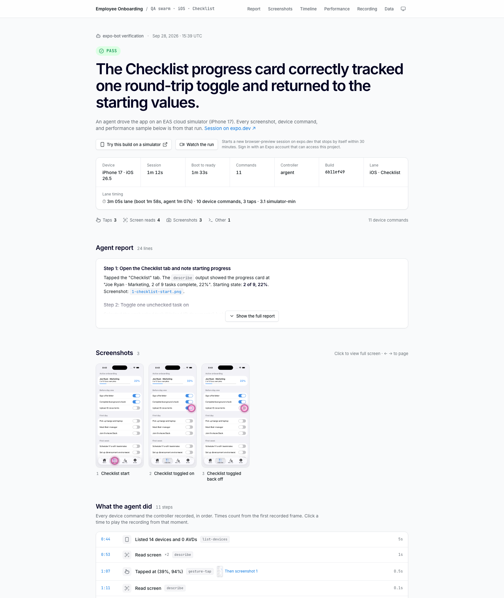
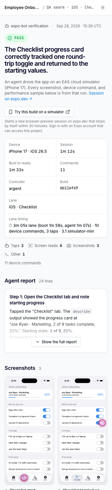

<h1 align="center">eas-simulator-evidence</h1>

<p align="center">
  Turn an <a href="https://docs.expo.dev/eas/simulator/">EAS Simulator</a> session into a shareable evidence site.<br>
  One static page with the verdict, screenshots, every device command, and the performance charts to help you easily consume what happened.
</p>

<p align="center">
  <a href="https://www.npmjs.com/package/eas-simulator-evidence"></a>
  <a href="LICENSE"></a>
  
</p>

<p align="center">
  
</p>

<br>

An agent, a test runner, or a script drives your app on a cloud simulator. This tool takes what the run left behind and builds one page from it. Any app, any CI, any host, any way of driving the device. The only requirement is that the run happened on EAS Simulator.

## Try it in one minute

No simulator and no Expo account needed. The repo ships a real run.

```sh
git clone https://github.com/jacobhammerle/eas-simulator-evidence
cd eas-simulator-evidence
npm run demo
```

## What you get

- **A verdict** as a status pill and a headline. Six statuses:
  - `PASS`: the run met its pass condition. Green.
  - `FAIL`: it did not. Red, and the screenshot the verdict names is tagged.
  - `REPLICATED`: the reported bug happened. Amber, because the run itself worked.
  - `CONFIRMED`: the same as replicated, under the name some agents use. Amber.
  - `NOT-REPLICATED`: the reported bug did not happen. Green.
  - `INCONCLUSIVE`: no clear result. Grey.
- **Screenshots** in capture order, with a full-screen viewer and a ring where the agent tapped.
- **What the agent did.** Every tap, swipe, and screen read, with timing, from the session itself. A tap links to the screenshot it produced. A time plays the recording from that moment.
- **App performance.** CPU, memory, and network for the whole run, with the taps and the app launch marked. Hover for the value at any moment and the step that caused it.
- **The agent's report**, rendered from its Markdown. A screenshot it names opens in the viewer.
- **"Try this build"**, a button that opens the same build in a fresh simulator session on expo.dev.
- **The full screen recording**, embedded, with nothing downloaded until you press play. Plus the raw data.

The page is one `index.html` plus its assets. Nothing loads from a CDN, it opens from `file://`, and it looks right on a phone, in light and dark, with three screenshots or fifty. Paste the link in Slack or a pull request and the preview shows the verdict and the first screenshot.

<p align="center">
  
</p>

## How it works

Your run gives the tool three things: a folder of screenshots in capture order (`1-home.png`, `2-settings.png`, ...), a subject such as `PR #12`, and a verdict line such as `PASS: the checkout flow completed`. Everything else comes from the session.

```sh
# 1. Start a cloud simulator with your build installed
npx eas-cli@latest simulator:start --platform ios --type agent-device \
  --build-id "$BUILD_ID" --non-interactive --name "PR #12 evidence"

# 2. Drive the app your way. Save screenshots into evidence/. Decide on a verdict.
npx eas-cli@latest simulator:exec npx agent-device@latest screenshot evidence/1-home.png --platform ios
echo "PASS: the home screen rendered" > verdict.txt

# 3. Stop the session, collect its data, build the site into evidence/site/, deploy it
npx eas-simulator-evidence@latest run evidence --stop --subject "PR #12" \
  --verdict-file verdict.txt --build-id "$BUILD_ID" --deploy-alias pr-12-evidence

# 4. Post it where people look
npx eas-simulator-evidence@latest comment evidence "$URL" --verdict-file verdict.txt | gh pr comment 12 --body-file -
```

Step 2 is yours: an AI agent, a Maestro flow, Appium, or a shell script. If the run never saved a file, `run --screenshots` downloads the session's own captures. Add `--fail-on fail` and the command exits 3 on a FAIL verdict, after the site is up, so the CI job goes red on its own.

## In CI

One command drops a ready-made workflow into your project:

```sh
npx eas-simulator-evidence@latest init github-actions   # or: eas-workflows, gitlab-ci, local
```

| Recipe | What it does |
| --- | --- |
| [github-actions.yml](recipes/github-actions.yml) | Evidence on every pull request, published to GitHub Pages, with a PR comment |
| [eas-workflows.yml](recipes/eas-workflows.yml) | Evidence on every pull request, as an EAS Workflow, on EAS Hosting |
| [gitlab-ci.yml](recipes/gitlab-ci.yml) | Evidence on every merge request, kept as a job artifact or on GitLab Pages |
| [local.sh](recipes/local.sh) | The whole loop on your machine |

On GitHub, the tool is also an Action. After your run has saved its screenshots:

```yaml
- uses: jacobhammerle/eas-simulator-evidence@v0
  id: evidence
  with:
    subject: PR #${{ github.event.pull_request.number }}
    verdict-file: verdict.txt
    build-id: ${{ env.BUILD_ID }}
    deploy-alias: pr-${{ github.event.pull_request.number }}-evidence
    fail-on: fail
  env:
    EXPO_TOKEN: ${{ secrets.EXPO_TOKEN }}
```

Outputs: `url`, `site-dir`, `kind`, and `verdict`. Leave out `deploy-alias` and upload `site-dir` wherever you host.

## Host it anywhere

The site is a folder of static files with relative paths. Put `evidence/site/` wherever you keep such things:

| Host | How |
| --- | --- |
| EAS Hosting | `run --deploy-alias pr-12-evidence`, or `deploy evidence --alias pr-12-evidence` |
| GitHub Pages | `actions/upload-pages-artifact` with `path: evidence/site`, then `actions/deploy-pages` |
| GitLab Pages | Copy it to `public/` in a `pages` job |
| S3, GCS, R2 | `aws s3 sync evidence/site s3://my-bucket/pr-12/` |
| Netlify, Vercel, Cloudflare Pages | Point the deploy at `evidence/site` |
| No host | Upload the folder as a CI artifact |

Pass `--url` with the page's final address so link previews show the first screenshot; with `--deploy-alias` the tool knows it already. To keep many runs on one host, give each its own folder and build a landing page with `index`.

## Commands

```
eas-simulator-evidence run     <dir> --subject "<label>" --verdict "<line>"   collect, then build
eas-simulator-evidence build   <dir> --subject "<label>" --verdict "<line>"   build the site only
eas-simulator-evidence collect <dir> [--session <id>]                          pull the session data only
eas-simulator-evidence open    <dir>                                           serve the site on localhost
eas-simulator-evidence deploy  <dir> [--alias <name>]                          deploy to EAS Hosting
eas-simulator-evidence comment <dir> <siteUrl> --verdict "<line>"              a pull-request comment
eas-simulator-evidence thumbs  <dir> <siteUrl>                                 thumbnails for a comment
eas-simulator-evidence verdict "<line>" [--badge]                              normalize a verdict line
eas-simulator-evidence index   <dir-of-sites>                                  one page over many runs
eas-simulator-evidence sweep   [--older-than 30]                               stop stale preview sessions
eas-simulator-evidence init    <target>                                        copy a CI recipe into the project
```

Run any command with `--help`. The full reference, the verdict grammar, the session data schema, and the programmatic API are in [docs/reference.md](docs/reference.md).

## Requirements

- Node 20 or newer. Run it with `npx eas-simulator-evidence@<version>`, or install it as a devDependency. In a multi-job pipeline, every job that runs the tool needs its install step.
- An Expo account with EAS Simulator access for `collect`, `deploy`, and `sweep`. In CI, set `EXPO_TOKEN` to a personal access token. Nothing else in the tool talks to the network.

## Using it from an agent

Point Claude Code, Cursor, or any agent that reads skills at [skills/eas-simulator-evidence/SKILL.md](skills/eas-simulator-evidence/SKILL.md). It covers naming screenshots, writing the verdict line, and running the tool.

## Contributing

Issues and pull requests are welcome. See [CONTRIBUTING.md](CONTRIBUTING.md) and the [changelog](CHANGELOG.md).

## License

MIT
