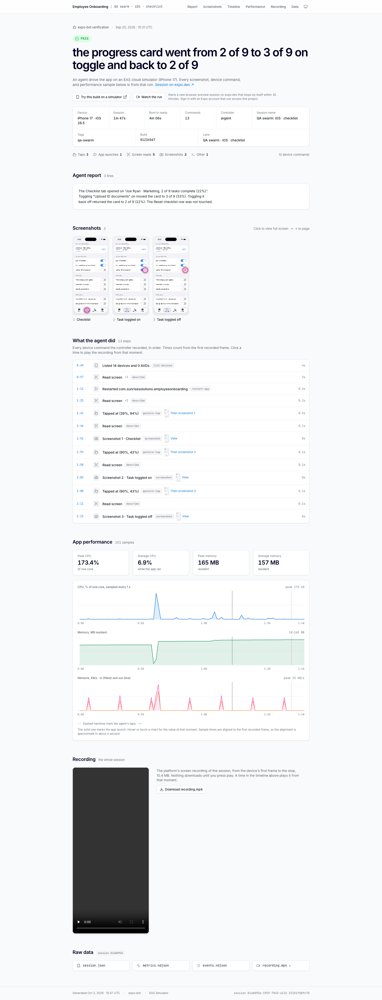

<h1 align="center">eas-simulator-evidence</h1>

<p align="center">
  Proof of what happened on an <a href="https://docs.expo.dev/preview/eas-simulator/introduction/">EAS Simulator</a> run, as one page anyone can open.<br>
  The verdict, the screenshots, every tap, the performance charts, and the recording. Static, shareable, no login.
</p>

<p align="center">
  <a href="https://www.npmjs.com/package/eas-simulator-evidence"></a>
  <a href="LICENSE"></a>
  
</p>

<p align="center">
  <a href="https://employee-onboarding--evidence-demo.expo.app"></a>
</p>

<p align="center">
  <a href="https://employee-onboarding--evidence-demo.expo.app"><strong>Open the live page</strong></a> · a real run, hosted on EAS Hosting
</p>

<br>

An agent or a script drives your app on an EAS Simulator. When the session ends, this tool turns it into one static page: the verdict, the screenshots with the taps marked, every device command with its timing, CPU and memory, and the session recording. Put the link in the pull request. Reviewers open it in a browser, on any OS, with no Expo account.

## Why add it

- **Proof instead of claims.** An agent says the fix works. The page shows the screens, the taps, and the recording that back it up.
- **One link for review.** The PR comment carries the verdict, the thumbnails, and the link. Nobody needs a Mac or a simulator to check the work.
- **Any driver.** agent-device, argent, Appium, Maestro, or a shell script. The tool reads the session, not the driver.
- **Built for CI.** The exit code follows the verdict, there is a JUnit file, a ready PR comment, and a GitHub Action.
- **Nothing to install, nothing to run.** Zero dependencies. The output is a folder of static files. Put it on EAS Hosting, GitHub Pages, S3, or keep it as a CI artifact.

## Give it a try

No simulator and no Expo account needed. The run behind the [live page](https://employee-onboarding--evidence-demo.expo.app) is in the repo.

```sh
git clone https://github.com/jacobhammerle/eas-simulator-evidence
cd eas-simulator-evidence
npm run demo
```

## What you get

- **The verdict** as a colored pill and a headline: `PASS`, `FAIL`, `REPLICATED`, `CONFIRMED`, `NOT-REPLICATED`, or `INCONCLUSIVE`.
- **Screenshots** in capture order, with a ring where the tap landed and a full-screen viewer.
- **The timeline.** Every tap, swipe, and screen read with timing. A tap links to its screenshot. A time plays the recording from that moment.
- **Performance.** CPU, memory, and network for the whole run, with the taps and the app launch marked.
- **The agent's report**, rendered from Markdown.
- **The recording**, playable on the page. It loads nothing until you press play.
- **A "Try this build" button** that opens the same build in a new simulator session on expo.dev.

It is one `index.html` and its assets. It opens from `file://`, works on a phone, and follows light or dark mode.

## How it works

Three inputs: a folder of screenshots, a subject, and a verdict line. The tool gets everything else from the session.

1. **Run the app** on an EAS Simulator. Save screenshots in order: `1-home.png`, `2-settings.png`, and so on.
2. **Write the verdict.** One line, like `PASS: the home screen rendered`. The lines after it become the report.
3. **Run the tool.** It stops the session, pulls the session data, builds the page, and deploys it.

```sh
# 1. Start a cloud simulator with your build installed, then drive it your way
npx eas-cli@latest simulator:start --platform ios --type agent-device \
  --build-id "$BUILD_ID" --non-interactive --name "PR #12 evidence"
npx eas-cli@latest simulator:exec npx agent-device@latest screenshot evidence/1-home.png --platform ios

# 2. Write the verdict
echo "PASS: the home screen rendered" > verdict.txt

# 3. Stop, collect, build, deploy. Prints the URL; save it as URL for step 4.
npx eas-simulator-evidence@latest run evidence --stop --subject "PR #12" \
  --verdict-file verdict.txt --build-id "$BUILD_ID" --deploy-alias pr-12-evidence

# 4. Post it on the pull request
npx eas-simulator-evidence@latest comment evidence "$URL" --verdict-file verdict.txt | gh pr comment 12 --body-file -
```

`--screenshots` uses the session's own captures when nothing saved any. `--fail-on fail` exits 3 on a FAIL, after the site is up, so the CI job goes red.

## In CI

A CI job does the same four steps as above. The runner never needs macOS: the simulator runs on EAS, and the job only sends commands. The job needs two things: `EXPO_TOKEN` as a secret, and the id of an EAS build to install.

**The quick way.** Copy a complete workflow into your project and edit the "drive the app" step:

```sh
npx eas-simulator-evidence@latest init github-actions   # or: eas-workflows, gitlab-ci, local
```

The copied workflow starts the simulator, drives the app, builds the page, publishes it, and comments on the pull request. See [github-actions.yml](recipes/github-actions.yml), [eas-workflows.yml](recipes/eas-workflows.yml), [gitlab-ci.yml](recipes/gitlab-ci.yml), or [local.sh](recipes/local.sh).

**Already have a workflow?** Add the GitHub Action after the step that drives the app and saves the screenshots. It stops the session, builds the page, deploys it, and fails the job on a FAIL verdict:

```yaml
- uses: jacobhammerle/eas-simulator-evidence@v0
  id: evidence
  with:
    subject: PR #${{ github.event.pull_request.number }}
    verdict-file: verdict.txt
    stop: true
    deploy-alias: pr-${{ github.event.pull_request.number }}-evidence
    fail-on: fail
  env:
    EXPO_TOKEN: ${{ secrets.EXPO_TOKEN }}
```

The step outputs `url`, `kind`, `verdict`, and `site-dir`. Use `url` in a PR comment, or upload `site-dir` to another host instead of setting `deploy-alias`.

## Host it anywhere

The site is a folder of static files. `run --deploy-alias` puts it on EAS Hosting. Or upload `evidence/site` to GitHub Pages, GitLab Pages, S3, Netlify, Vercel, or Cloudflare Pages, or keep it as a CI artifact. Pass `--url` when you know the final address, so link previews work. For many runs on one host, run `index` for a landing page over all of them.

## Commands

```
eas-simulator-evidence run     <dir> --subject "<label>" --verdict "<line>"   collect, then build
eas-simulator-evidence build   <dir> --subject "<label>" --verdict "<line>"   build the site only
eas-simulator-evidence collect <dir> [--session <id>]                          pull the session data only
eas-simulator-evidence open    <dir>                                           serve the site on localhost
eas-simulator-evidence deploy  <dir> [--alias <name>]                          deploy to EAS Hosting
eas-simulator-evidence comment <dir> <siteUrl> --verdict "<line>"              a pull-request comment
eas-simulator-evidence thumbs  <dir> <siteUrl>                                 thumbnails for a comment
eas-simulator-evidence verdict "<line>" [--badge]                              normalize a verdict line
eas-simulator-evidence index   <dir-of-sites>                                  one page over many runs
eas-simulator-evidence sweep   [--older-than 30]                               stop stale preview sessions
eas-simulator-evidence init    <target>                                        copy a CI recipe into the project
```

Every command has `--help`. The full reference, the verdict grammar, the session data schema, and the programmatic API are in [docs/reference.md](docs/reference.md).

## Requirements

- Node 20 or newer. Run it with `npx eas-simulator-evidence@<version>` or add it as a devDependency.
- An Expo account with EAS Simulator access, for `collect`, `deploy`, and `sweep`. In CI, set `EXPO_TOKEN` to a personal access token. Nothing else touches the network.

## For agents

Claude Code, Cursor, and other tools that read skills can use [skills/eas-simulator-evidence/SKILL.md](skills/eas-simulator-evidence/SKILL.md). It covers screenshot naming, the verdict line, and the command order.

## Contributing

Issues and PRs are welcome. See [CONTRIBUTING.md](CONTRIBUTING.md) and the [changelog](CHANGELOG.md).

## License

MIT
